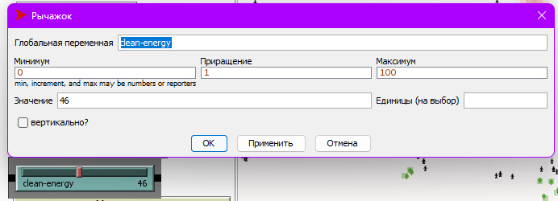
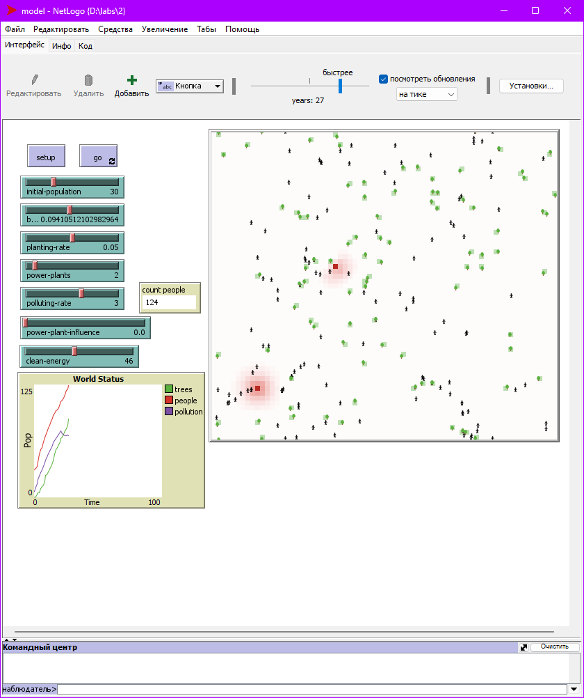
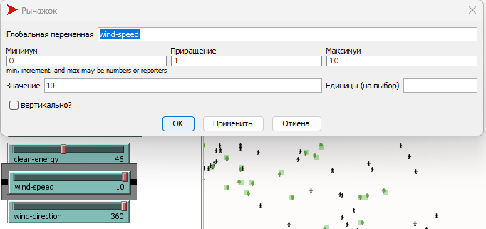
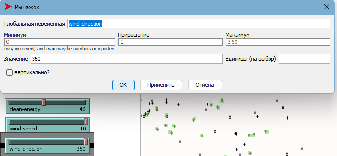
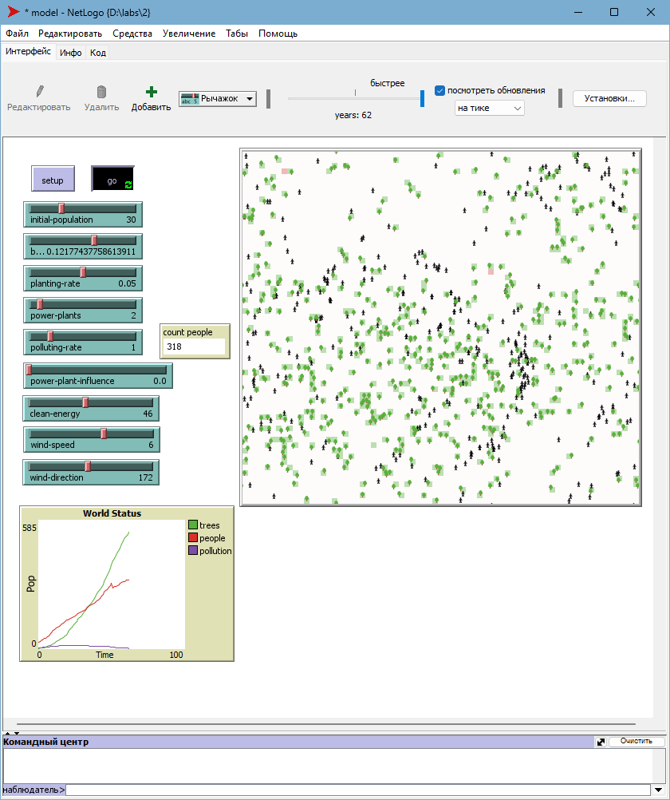

# lab2
## СПм-22-6, **Бохан Іван Анатолійович**
### Лабораторна робота №**2**. Редагування імітаційних моделей у середовищі NetLogo

 

### Варіант 4, модель у середовищі NetLogo:
[Urban Suite - Pollution](https://www.netlogoweb.org/launch#http://www.netlogoweb.org/assets/modelslib/Curricular%20Models/Urban%20Suite/Urban%20Suite%20-%20Pollution.nlogo)
 
### Внесені зміни у вихідну логіку моделі, за варіантом:

**Реалізувати позитивний вплив наявності на імітаційному полі електростанцій на вірогідність появи нових людей:**

<pre>
to update-power-plant-influence
  ask patches with [is-power-plant? = true] [
    ask neighbors [
      set power-plant-influence power-plant-influence + 0.1
    ]
  ]
end
</pre>
Створив нову функцію, що створює та оновлює значення **power-plant-influence**(Вплив електростанції).

Реалізував позитивний вплив наявності електростанцій на вірогідність появи нових людей:
<pre>
to reproduce  ;; person procedure
  if health > 4 and random-float 1 < birth-rate + power-plant-influence [
    hatch-people 1 [
      set health 5
    ]
  ]
end
</pre>

<pre>
to update-clean-energy-effect
   ask patches with [clean-energy > 0] [
     ask neighbors [
     set birth-rate birth-rate + (clean-energy * 0.000000000001)
     ]
   ]
end
</pre>
Додана властивість power-plant-influence для клітин, щоб відслідковувати вплив електростанцій на них. Електростанції тепер впливають на сусідні клітини, збільшуючи вірогідність висадки дерев та народження нових людей.

**Збільшити вірогідність висадки дерев у клітинах поблизу електростанцій:**

<pre>
to maybe-plant  ;; person procedure
  if random-float 1 < planting-rate + power-plant-influence [
    hatch-trees 1 [
      set health 5
      set color green
    ]
  ]
end
</pre>

Додав важіль **clean-energy**:

**Модель у процесі симуляції:**

### Внесені зміни у вихідну логіку моделі, на власний розсуд:

Розгляну вплив вітру на росповсюдження зараження. Додано нові атрибути wind-speed, wind-direction.

**patches-own** тепер має такий вигляд:

<pre>
patches-own [
  pollution
  is-power-plant?
  wind-speed
  wind-direction
]
</pre>

Додав новий метод **move** для симуляції вітру:

<pre>
to move  ;; wind-path procedure
  rt random-float 30 - random-float 30
  fd wind-speed
  if pcolor = red [ set color blue - 2 ]
end
</pre>

Зменшив еффект зараження зі збільшенням щвидкості вітру, відтепер метод **polute** виглядатиме ось так:

<pre>
to pollute  ;; patch procedure
  if is-power-plant? [
    set pcolor red
    set pollution polluting-rate
  ]
  
 if pollution > 0 [
    set pollution pollution - (pollution * wind-speed / 100)
  ]

  set pcolor scale-color red (pollution - .1) 5 0
end
</pre>
Прибрав з **patches-own** змінні **wind-speed** та **wind-direction** та додав два важіля:

### Дослідження виконаних змін:
**Вплив швидкості вітру на забрудненність середовища:**
Досліджується вплив значень параметру **wind-speed** на показники **count-people**, **trees**, **pollution**.
Експерименти проводяться при таких параметрах:
- **initial-population**: 30
- **birth-rate**: 0.1
- **power-plants**: 2
- **polluting-rate**: 3
- **planting-rate**: 0.05

**Результати експерименту:**

<table>
<thead>
<tr><th>Швидкість вітру</th><th>Дерева max</th><th>Населення max</th><th>Забруднення max</th></tr>
</thead>
<tbody>
<tr><td>0</td><td>84</td><td>37</td><td>129</td></tr>
<tr><td>2</td><td>86</td><td>34</td><td>102</td></tr>
<tr><td>4</td><td>89</td><td>36</td><td>86</td></tr>
<tr><td>6</td><td>83</td><td>35</td><td>71</td></tr>
<tr><td>8</td><td>67</td><td>36</td><td>52</td></tr>
<tr><td>10</td><td>59</td><td>37</td><td>41</td></tr>
</tbody>
</table>

У висновку експерименту можна визначити, що при збільшенні вітру забруднення зменшується, а також зростає вірогідність розмноження та посадки нових дерев, що позитивно впливає на кількість людей у популяції та тривалість життя.

